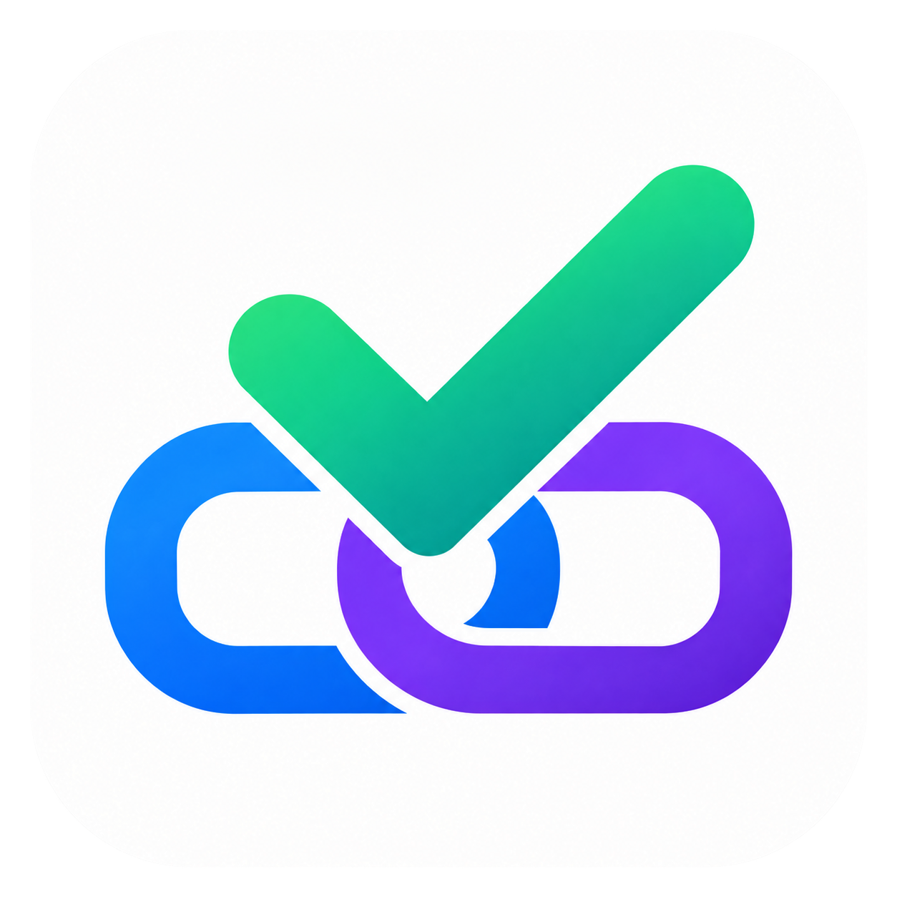

# To Do Connect



**Connect your task services to AI.**

English · [한국어](README.ko.md)

Use Microsoft To Do and Google Tasks from your AI assistant. Connect one account or several, from either or both services, and keep using the task apps you already know.

The program runs on your computer and talks directly to task providers. There is no developer-hosted relay. Native packages include the program: no Go, Node.js or Docker installation is required.

> Development preview, not a stable release. Source and local development packages may be newer than [GitHub Releases](https://github.com/Kook-Dohyun/To-Do-Connect/releases). GitHub distribution and the OpenAI public plugin directory are separate.

## What you can do

| Service | Capabilities |
| --- | --- |
| Microsoft To Do | Create, read, edit, complete and delete lists, tasks and checklist steps |
| Google Tasks | Create, read, edit, complete and delete lists and tasks; create subtasks and move or reorder tasks |
| Connections | Reuse saved connections, add multiple accounts and disconnect accounts individually |

The current server exposes 27 tools. It does not synchronize or copy tasks between services.

## Install

Choose one path; you do not need all three.

- **Codex plugin ZIP:** download the plugin ZIP for your OS and CPU, then use **Plugins → Add → Upload plugin archive** in a supported desktop client.
- **GitHub installation with AI:** copy the request below into your local AI assistant.
- **Other MCP clients:** install the native package and configure its executable with `serve`. See [installation and MCP JSON](docs/installation.md).

```text
Install To Do Connect from https://github.com/Kook-Dohyun/To-Do-Connect.
Check my execution host's OS/CPU and existing installation first.
Use a published prebuilt package and verify its checksum; do not build from
source or install Go, Node.js or Docker. If only preview packages are available,
tell me the version. Register it in my chosen local MCP/plugin client.
Preserve saved connections, verify tool discovery, then ask which task service
and account I want to connect. Guide any unfinished setup.
```

If no suitable published package exists, use a provided development archive or wait for a release. Do not assume the source version has a downloadable asset.

## Connect your accounts

- **Microsoft To Do:** complete browser sign-in with a Microsoft personal account. The application ID is built in; no environment variable or app registration is needed.
- **Google Tasks:** use your own Google Cloud project, enable Tasks API and create a Desktop OAuth client. The bundled skill guides setup, imports the downloaded JSON locally and opens browser sign-in. Existing projects, clients and working connections are reused.

Passwords, MFA and consent stay in the provider's UI. Working connections do not require login on every request.

## Try it

```text
Show my task lists.
Create a list called Server-room checks.
Add “1. Check server identity” with steps “Record hostname” and “Record OS version”.
Show which tasks and steps I have completed.
```

When multiple accounts or lists match, the assistant asks which one to use.

## Platforms and privacy

Packages target Windows, macOS and Linux on x64 and ARM64. macOS/Linux need a working OS key store or an explicitly configured encryption key. Binaries are not currently code-signed or notarized. Docker is optional.

Credentials are encrypted in your user data directory, separately from the program and repository. Task results are sent to the AI application you use; local execution does not mean the AI service never receives task content.

[Installation](docs/installation.md) · [Runtime and Docker](docs/runtime.md) · [Development](docs/development.md) · [Packaging](docs/releases.md) · [Verification](docs/ci.md)

[Support](docs/support.md) · [Privacy](docs/privacy.md) · [Terms](docs/terms.md)

[MIT License](LICENSE). Microsoft To Do and Google Tasks belong to their respective owners. This is an independent community project, not an official Microsoft or Google product.
